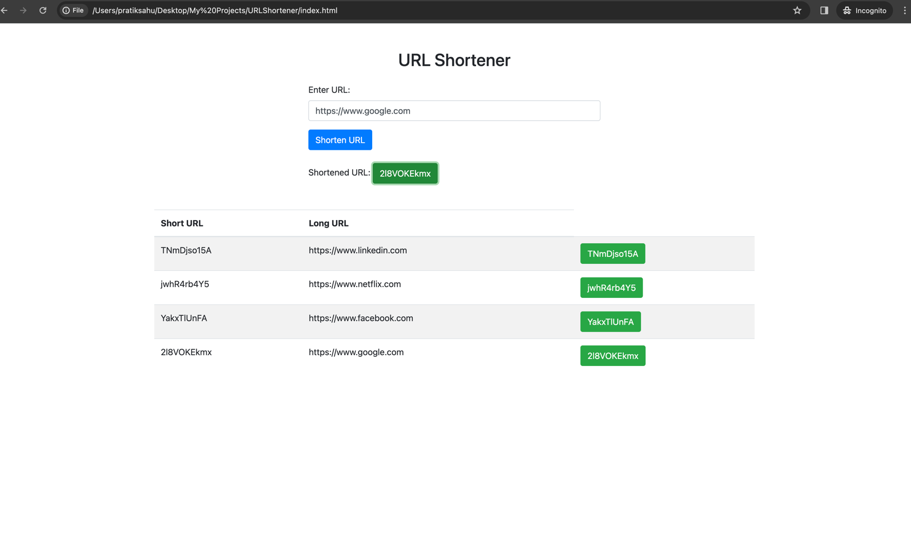
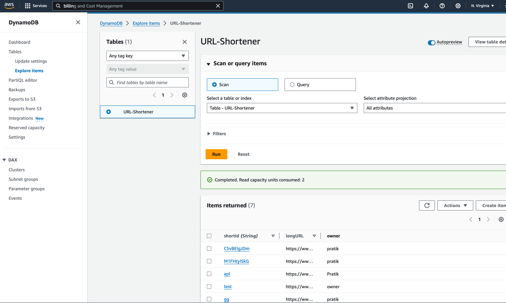
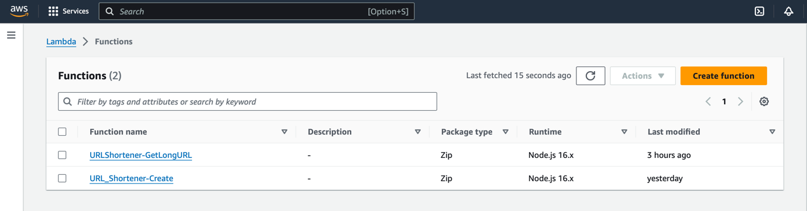
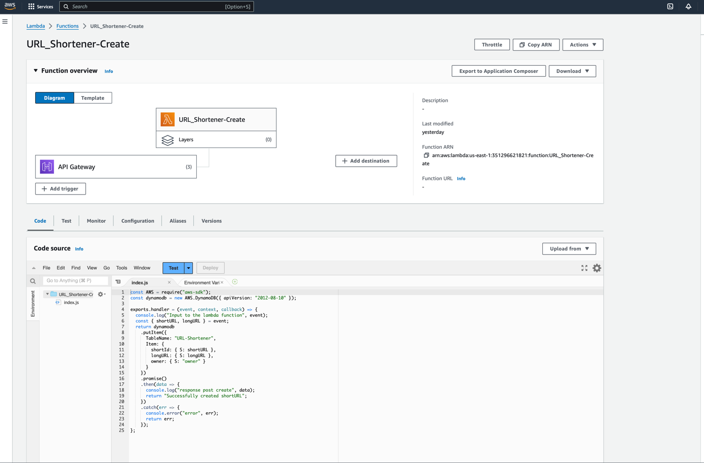
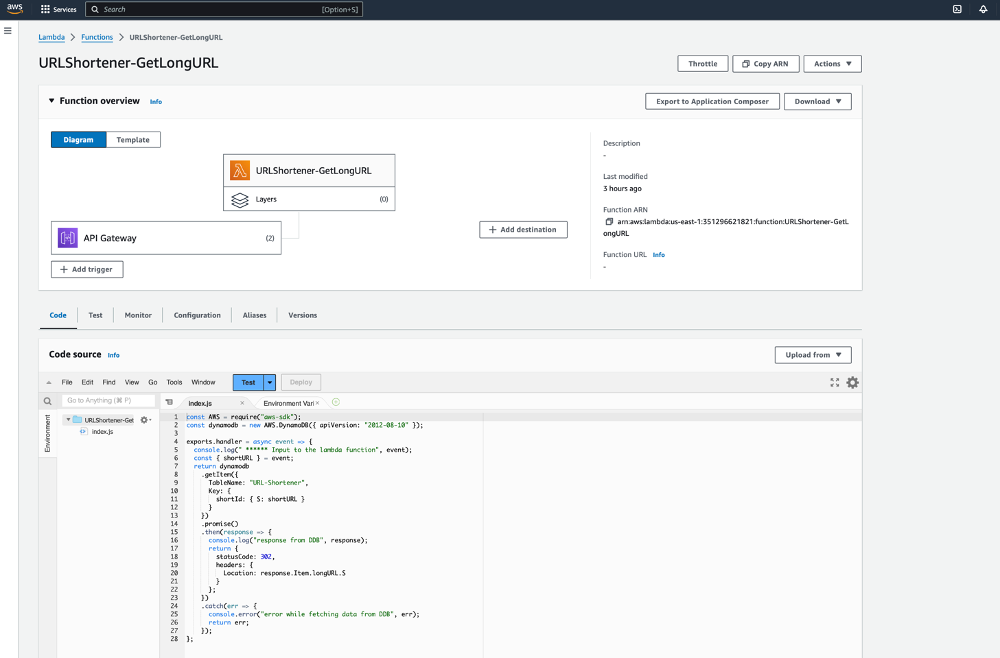
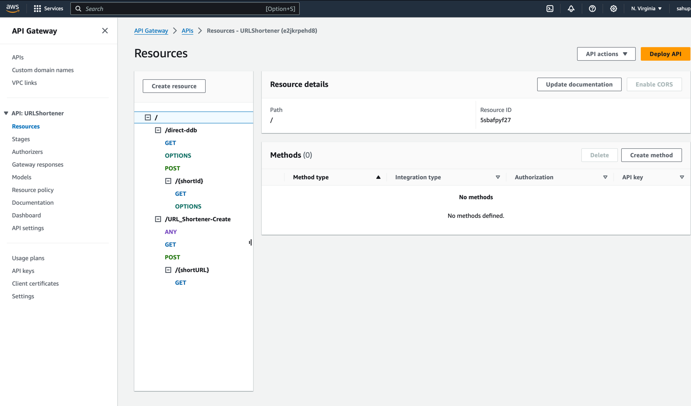

## URL Shortener Project with AWS
This project is a demonstration of a URL shortener using AWS services. The main components of this project include DynamoDB for storing the long and short URLs, Lambda functions to read and write these URLs, and API Gateway to create GET and POST endpoints for interacting with the URLs.

### Features
- **Shortening URLs**: Users can enter a long URL into the provided input field. Upon submission, a unique short ID is generated for the URL.

- **Storing URLs**: The long URL along with its corresponding short ID is stored in DynamoDB.

- **Accessing Shortened URLs**: Users can click on the generated short URL to open the corresponding long URL in a new tab.

### Components
#### DynamoDB
DynamoDB is used as the database to store the long and short URLs. It provides a fast and flexible NoSQL database service for storing and retrieving data.

#### Lambda Functions
Lambda functions are used to read and write URLs to DynamoDB. They handle the business logic for generating short IDs and retrieving long URLs based on the provided short IDs.

#### API Gateway
API Gateway is used to create the GET and POST endpoints for interacting with the URLs. It provides a scalable and secure way to create, deploy, and manage APIs.

#### HTML Page and JavaScript
A simple HTML page is provided to allow users to input long URLs. Vanilla JavaScript code is used to handle form submission, generate short IDs, and open the corresponding long URLs.

### Usage
- Clone the repository to your local machine.
- Set up the necessary AWS resources including DynamoDB, Lambda functions, and API Gateway.
- Update the API endpoint URL in the JavaScript code to point to your API Gateway endpoint.
- Open the index.html file in a web browser.
- Enter a long URL and click the "Shorten URL" button.
- Click on the generated short URL to open the corresponding long URL in a new tab.

#### Dependencies
- **AWS SDK**: Used to interact with AWS services programmatically.
- **Bootstrap**: Used for styling the HTML page.
- **jQuery**: Used for making AJAX requests to the API endpoint.
